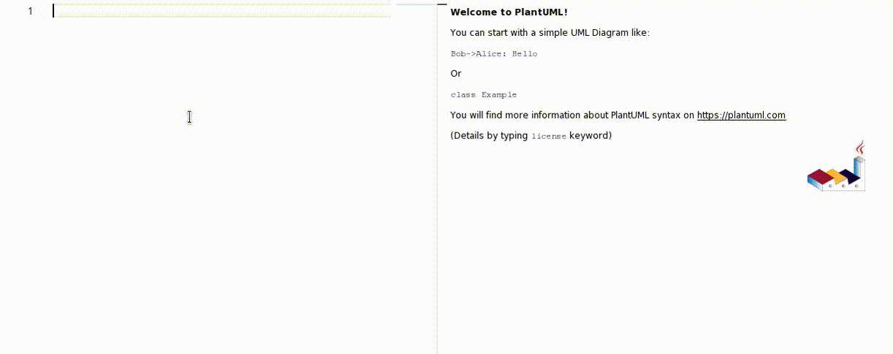

# monaco-plantuml

PlantUML extension for monaco editor with better intellisense


[Online Demo](https://pansinm.github.io/monaco-plantuml/)

## Installation

```bash
yarn add @sinm/monaco-plantuml
```

## Usage

```ts
import { PUmlExtension } from '@sinm/monaco-plantuml';

const extension = new PUmlExtension();

const disposer = extension.active(editor);

// when destroyed
disposer.dispose();
```
## Run with web worker

1. webpack 5
```ts
import { PUmlExtension } from '@sinm/monaco-plantuml';
// relative
const worker = new Worker(new URL('../node_modules/@sinm/monaco-plantuml/lib/puml.worker.js', import.meta.url));
const extension = new PUmlExtension(worker);
```

2. vite
```ts
import { PUmlExtension } from '@sinm/monaco-plantuml';
import PUmlWorker from '@sinm/monaco-plantuml/lib/puml.worker?worker';
// relative
const worker = new PUmlWorker();
const extension = new PUmlExtension(worker);
```
